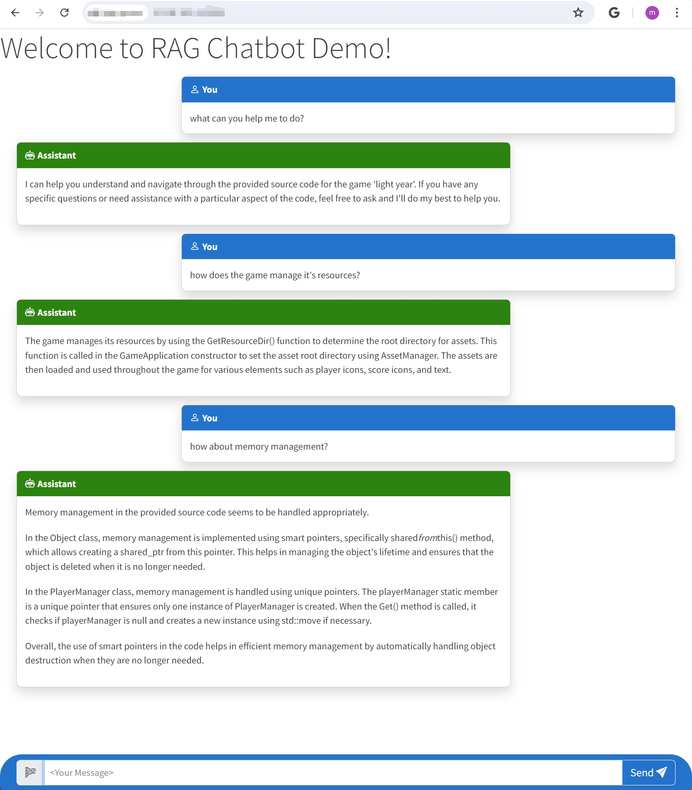

## Project Overview
This chatbot serves developers by interpreting complex code bases, effectively reducing the time required for reading and understanding by 50%. It uses the code base of a 2D scrolling shooter spaceship fighting game as a learning source and acts as an assistant to answer questions about the code, the inner workings of the game engine, and provides suggestions for extending its functionality.
### Major Components of the Project:
- **Vector Database**: Utilizes OpenAI embeddings within the Pinecone Vector Database to convert source code into searchable vectors, enabling efficient query handling and code retrieval.
- **Retrieval-Augmented Generation (RAG)**: Integrates LangChain with OpenAI's GPT-3.5 Turbo to refine prompts in Retrieval-Augmented Generation, enhancing the analysis of domain-specific source code.
- **Deployment**: The application is deployed as a full-stack Flask application on AWS EC2 and is containerized using Docker, ensuring scalable and robust access to the service.
## Game Code Base
[Light Years Game 🛩️](https://github.com/TutLeeUdemy/LightYears.git)
## Chatbot
